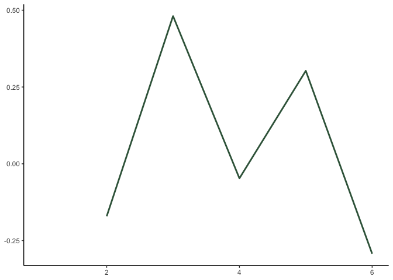

<!-- README.md is generated from README.Rmd. Please edit that file -->

# semdistflow

<!-- badges: start -->
<!-- badges: end -->

## Overview

‘semdistflow’ transforms any user-specified text into sequential bigrams
(e.g. ‘The dog drinks the milk’ to dog-drink, drink-milk, etc.). The
package can compute metrics of semantic distance for each bigram. Users
have many options for parameterizing semantic distance and tailoring
their analyses to their own unique constraints (e.g., omitting
stopwords, lemmatizing tokens, dimensionality of word embeddings).

## Installation

You can install the development version of semdistflow from
[GitHub](https://github.com/) with:

``` r
# install.packages("devtools")
devtools::install_github("Reilly-ConceptsCognitionLab/semdistflow")
#> Skipping install of 'semdistflow' from a github remote, the SHA1 (bc8d9b9a) has not changed since last install.
#>   Use `force = TRUE` to force installation
```

## Example of Cleaning Function

This is a basic example which shows you how the cleanme function works:

``` r
library(semdistflow)
library(tidyverse)

doc_id <- "fox"
doc_text <- "The quick brown fox jumps over the lazy dog."
fox_text <-as.data.frame(cbind(doc_id,doc_text))
fox_text
#>   doc_id                                     doc_text
#> 1    fox The quick brown fox jumps over the lazy dog.
```

``` r
fox_clean <- cleanme(fox_text)
#> Performing cleaning retaining pronouns
fox_clean
#> # A tibble: 1 × 3
#> # Groups:   doc_id [1]
#>   doc_id doc_text                                     doc_clean                 
#>   <chr>  <chr>                                        <chr>                     
#> 1 fox    The quick brown fox jumps over the lazy dog. " quick brown fox jumps l…
```

## Example of Semantic Distance Function

This is a basic example which shows you how the cleanme function works:

``` r
fox_token <-fox_clean %>%
  group_by(doc_id, doc_text) %>%
  tidytext::unnest_tokens(word, doc_clean, drop=F)

fox_token$lemma<- textstem::lemmatize_words(fox_token$word)


fox_token
#> # A tibble: 6 × 5
#> # Groups:   doc_id, doc_text [1]
#>   doc_id doc_text                                     doc_clean      word  lemma
#>   <chr>  <chr>                                        <chr>          <chr> <chr>
#> 1 fox    The quick brown fox jumps over the lazy dog. " quick brown… quick quick
#> 2 fox    The quick brown fox jumps over the lazy dog. " quick brown… brown brown
#> 3 fox    The quick brown fox jumps over the lazy dog. " quick brown… fox   fox  
#> 4 fox    The quick brown fox jumps over the lazy dog. " quick brown… jumps jump 
#> 5 fox    The quick brown fox jumps over the lazy dog. " quick brown… lazy  lazy 
#> 6 fox    The quick brown fox jumps over the lazy dog. " quick brown… dog   dog
```

``` r
fox_dist <-  bigram_cos_sim(targetdf = fox_token, lookupdb = semdist15, colname1 = lemma, colname2 = word, flipped = T)
#> Isolating join columns
#> Adding missing grouping variables: `doc_text`
#> Joining data + print
#> Calculating pairwise cosine similarities
#> Writing output dataframe

fox_dist
#> # A tibble: 6 × 8
#>   doc_id doc_text       doc_clean word  lemma pair  cosine.dist flipped_cosine.…
#>   <chr>  <chr>          <chr>     <chr> <chr> <chr>       <dbl>            <dbl>
#> 1 fox    The quick bro… " quick … quick quick NA-q…     NA                NA    
#> 2 fox    The quick bro… " quick … brown brown quic…     -0.171             1.17 
#> 3 fox    The quick bro… " quick … fox   fox   brow…      0.481             0.519
#> 4 fox    The quick bro… " quick … jumps jump  fox-…     -0.0473            1.05 
#> 5 fox    The quick bro… " quick … lazy  lazy  jump…      0.303             0.697
#> 6 fox    The quick bro… " quick … dog   dog   lazy…     -0.293             1.29
```

``` r
ggplot(fox_dist, aes(x=as.numeric(row.names(fox_dist)), y=flipped_cosine.dist)) +  geom_line(color="#02401BD9", size= 1) + theme_classic() + xlab(NULL) + ylab(NULL)  + geom_label(aes(label=pair), size=3, data=fox_dist)  
#> Warning: Removed 1 row(s) containing missing values (geom_path).
#> Warning: Removed 1 rows containing missing values (geom_label).
```


