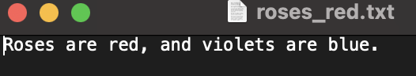
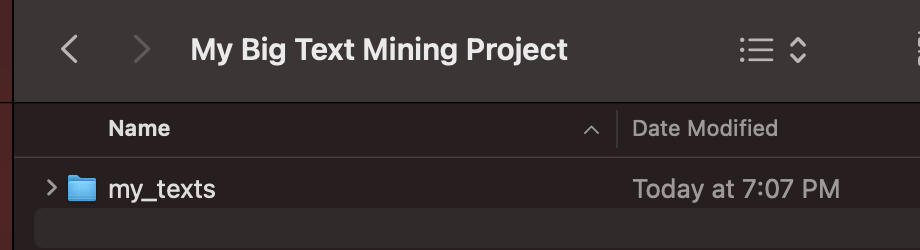
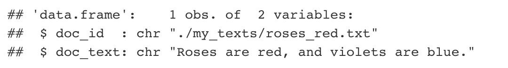
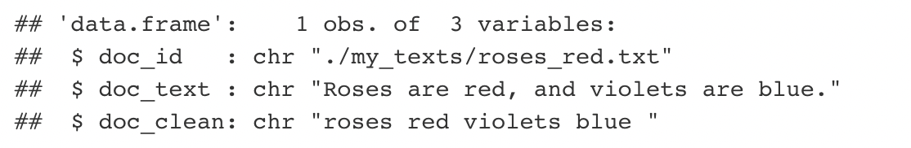
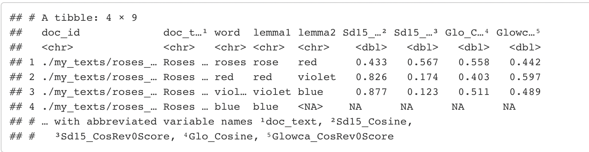
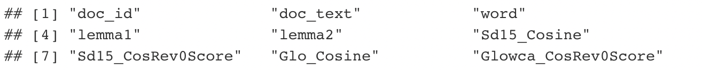

```{r, include = FALSE}
knitr::opts_chunk$set(
  collapse = TRUE,
  comment = "#>"
)
```

```{r, include=F}
#devtools::install_github("Reilly-ConceptsCognitionLab/semdistflow") # install package if haven't already
library(semdistflow)
library(tidytext)
library(tidyverse)
library(knitr)
library(kableExtra)
library(stringr)
library(zoo)
library(stringi)
library(printr)
library(here)
```

Semdistflow is designed to read in one or more language transcripts, clean and format them, and then output a vector of semantic distances corresponding to every running bigram in the language sample. For example, let's say you have a text file composed of just one sentence: <br />

{width=40%}

1.  <span style="color:red">readme()</span> reads the txt file into R, appends a document id based on its filename and formats the text as a dataframe. <br >
2. <span style="color:red">cleanme() </span> uses many regular expressions to clean and format the text. These include omitting contractions, converting to lowercase, omitting numbers, omitting stopwords, etc. <br/>
3. <span style="color:red">distme()</span> computes two metrics of semantic distance for each running pair of words in the language sample you just cleaned. These are outputted as a vector of word pairs.

# Step 1: Prep your texts
Semdistflow works on language transcripts formatted as txt files. The first function you will use readme() will append the filename of each txt file as a document_id to the subsequent dataframe that is read into R. This allows users to run many distinct documents at once, maintaining independence of each language transcript.  <br />

We recommend being systematic and deliberate about your processing pipeline and filenaming conventions. Language transcripts can easily proliferate. A sensible approach is to create a folder such as 'my_texts' in the project directory where you plan on processing your big text analysis project. Store your preprocessed files in that folder. Nominally, setting up a structure like this is probably a good idea.

{width=40%}

Remember that readme() will look for any txt file in whatever folder name you specify, so it is important that once you are finished processing a txt file that you move it out of 'my_texts' into another folder of your choice (e.g., 'texts_processed'). <br />

You have several options when reading text files into R using our readme() function.  If you just run 'readme()', R will look for any text files in your root directory. In contrast, the more systematic approach would be to dump your target files into a specific subfolder you create (my_texts) and call the function within that folder using: <br/>

readme(./my_texts) <br/>

# Step 2: readme() read in your texts
```{r, eval=F}
mytexts <- readme()  #all text files in the root directory
mytexts <- readme(./my_texts)  #all text files in the 'my_texts' folder of your directory
```

If readme() did its job, the resulting dataframe will have two columns "doc_id" and "doc_text". The doc_id is a distinct identifier corresponding to the filename of each text file you read into R. The doc_text corresponds to the raw (uncleaned and untouched) text within text file. The output should have a structure like this: <br/>

{width=70%}
<br />
As you can see, R read in the text file, appended a doc_id and inputted the raw text under the column name, doc_text.  Getting data into R is often half the battle, especially when working with string data. It's not crucial that you use the readme() function. You can use semdistflow to clean and compute distance on any character vector as long as it is nested within a dataframe with column names "doc_id" and "doc_text".  Any other document identifiers will be retained but ignored in subsequent steps. <br/>
<br/>

For the intrepid, here's the code that operates under the hood of readme()
```{r, eval=F}
readme <- function(folder_name = "my_texts"){
  file_list <- list.files(path = folder_name, pattern = "*.txt", recursive = TRUE, full.names = TRUE) #list files with .txt ending
  textdata <- lapply(file_list, function(x) {
    paste(readLines(x), collapse=" ")
  }) #apply readlines over the file list, no warning if last line is not complete
  data.table::setattr(textdata, "names", file_list) #add names attribute to textdata from file_list
  lapply(names(file_list), function(x){
    lapply(names(file_list[[x]]), function(y) setattr(DT[[x]], y, file_list[[x]][[y]]))
  }) #set names attribute over the list
  df1 <- data.frame(doc_id = rep(names(textdata), lengths(textdata)), doc_text = unlist(textdata), row.names = NULL) #convert to dataframe where names attribute is doc_id and textdata is text
  return(df1)
}
```


# Step 3: cleanme() clean and format texts 
Now you are cooking. Your text is in a dataframe with an identifier. You are ready to clean the data. The cleanme() step does lots of substitutions and transformations using regular expressions. We adapted a custom stopword list which removes function words (e.g., the, a) and many other 'empty'
lexical forms. If you want to know exactly what is getting cleaned and swapped during this process, you can [read our preprint by linking here to PsyArXiv](https://psyarxiv.com/6fuhv)

```{r, eval=F}
mycleantxt <- cleanme(dat) # dat is a dataframe prepped from readme()
```

Look what cleanme() did to our original doc_text.  First you'll notice that the dataframe has a new column called doc_clean.  Then if you look closely at doc_clean you'll notice some differences. There is no punctuation, and the stopwords 'and' and 'are' have been omitted. Magic!

{width=70%}<br />

<br />
Here's the annotated code showing omissions, substitutions and all other steps under the hood of the cleanme() function. Some of these code snips involve borrowed package dependencies from packages like stringi or textclean. Most are custom regex.

```{r, eval=F}
cleanme<- function(x) {
  load(here::here("data", "omissions_2023.rda"))
  load(here::here("data", "replacements_2023.rda"))
  omissions <- omissions_2023
  replacements <- replacements_2023
  message("Performing text cleaning.... sit tight!")
  y <- x
  x <- x %>% group_by(doc_id)
  x <- x$doc_text
  x <- tolower(x) #to lower
  x <- gsub("\"", " ", x)
  x <- gsub("\n", " ", x)
  x <- textclean::replace_date(x)
  x <- stringi::stri_replace_all_regex(x, "^" %s+% replacements$target %s+% "$", replacements$replacement, vectorize_all = FALSE)
  x <- gsub("`", "'", x)  # replaces tick marks with apostrophe for contractions
  x <- gsub("(\\d)(\\.)", "", x)   #look for period adjacent to any digit, replace with nothing
  x <- textclean::replace_contraction(x) #replace contractions
  x <- gsub("([[:alpha:]])([[:punct:]])", "\\1 \\2", x) #add a space between any alphabetic character and punctuation
  x <- gsub("-", " ", x) #replace all hyphens with spaces
  x <- tm::removeWords(x, omissions$target)
  x <- gsub("\\d+(st|nd|rd|th)", " ", x) #omits 6th, 23rd, ordinal numbers
  x <- gsub("[^a-zA-Z;.,]", " ", x) #omit numbers and most punctuation, retain alphabetic chars, comma, semicolon, periods
  x <- gsub("\\b[a-z]\\b{1}", " ", x) #omits any singleton alphabetic character
  x <- gsub("\\;", "\\.", x) #replace semicolons with periods
  x <- gsub("\\s{2,}", " ", x) #replace two or more spaces with a single space
  x <- unlist(strsplit(x, " "))
  x <- paste(x,collapse=" ")
  x <- gsub("person person", "person", x)
  x <- gsub("people people", "people", x)
  x <- gsub("(.*)(, and* )(\\w{1,}\\s\\w{1,})", "\\1. \\3", x)
  x <- gsub("(.*)(, but* )(\\w{1,}\\s\\w{1,})", "\\1. \\3", x)
  x <- gsub("(.*)(,* because* )(\\w{1,}\\s\\w{1,})", "\\1. \\3", x)
  x <- gsub("(.*)(,* then* )(\\w{1,}\\s\\w{1,})", "\\1. \\3", x)
  x <- gsub(",", "", x) # remove commas
  x <- gsub("([[:punct:]])", "", x) # remove periods
  doc_clean <- tm::stripWhitespace(x)
  cleandoc <- cbind(y, doc_clean)
  return(cleandoc)
}
```


# Step 4: distme() computes semantic distances
distme() works some serious magic. It takes your cleantxt and by default lemmatizes it then transforms it into a running vector of content words. After each running pair of content words we append two metrics of semantic distance. <br/>

```{r, eval=F}
mydistances <- distme(mycleantexts)
```

distme() takes two arguments. The first is an input text. The second is whether or not to lemmatize the text before running distance norms on it. By default, lemmatize=T. This lemmatizes all of your words converting them to their dictionary entries. This helps with term aggregation so that we have as few missing observations from morphological derivatives as possible. if you do not specify the lemmatize=T argument it defaults to true and will lemmatize your data. If you want distme() to just compute distances on the words you feed it then run distme(dat, lemmatize=F)

The output is a tibble that looks like this.... <br/>
{width=80%}<br />

Let's break this down by column name. Here they are...
{width=80%}<br />

The function for distme() is a bit complex. It computes cosine distance between the semantic vectors between every running pair of words in the language sample you feed it. Here it is!
```{r, eval=F}
distme <- function(targetdf, lemmatize=TRUE){
  message("Loading lookup databases and joining your data to SemDist15 and Glowca")
  #load lookup databases
  glowca_v1 <- readRDS(here("data", "glowca_vol1_2023.rda")) #rounded 5,subtlex matched 60k
  glowca_v2 <- readRDS(here("data", "glowca_vol2_2023.rda"))
  glowca <-  rbind(glowca_v1, glowca_v2)
  sd15 <-  readRDS(here("data", "semdist15_2023.rda"))
  if (lemmatize == TRUE) {
    #groups by factor variables and unlists the string, one word per row
    dat <-targetdf %>% group_by(doc_id, doc_text) %>% tidytext::unnest_tokens(word, doc_clean)
    #lemmatizes target dataframe on column labeled 'lemma1'
    dat2 <- dat %>% mutate(lemma1 = textstem::lemmatize_words(word))
    #join semdist15 and glowca lookup databases with target input dataframe
    joindf_semdist15 <- left_join(dat2, sd15, by=c("lemma1"="word")) %>% data.frame()
    joindf_glowca <- left_join(dat2, glowca, by=c("lemma1"="word")) %>% data.frame()
    #Select numeric columns for cosine calculations, eliminate columns with string data
    dat_sd15 <- joindf_semdist15 %>% select_if(is.numeric)
    datglo <- joindf_glowca %>% select_if(is.numeric)
    #convert join dataframes containing hyperparameter values (glowca and sd15) to matrices
    mat_sd15 <- as.matrix(dat_sd15)
    mat_glo <- as.matrix(datglo)
    #compute cosine distance for each running pair of words in sd15 and glowca
    vals_sd15 <- unlist(lapply(2:nrow(mat_sd15), function(i){
      lsa::cosine(mat_sd15[i-1,],  mat_sd15[i,])
    }))
    vals_glo <- unlist(lapply(2:nrow(mat_glo), function(i){
      lsa::cosine(mat_glo[i-1,], mat_glo[i,])
    }))
    #Convert matrices back to dataframes
    vals_sd15 <- data.frame(vals_sd15)
    vals_glo <- data.frame(vals_glo)
    #Rename first column of cosine distance values
    names(vals_sd15)[1] <- "Sd15_Cosine"
    names(vals_glo)[1] <- "Glo_Cosine"
    #Add NA to final row to match length, there is no pairwise distance for final observation
    vals_sd15[nrow(vals_sd15)+1, ] <- NA
    vals_glo[nrow(vals_glo)+1, ] <- NA
    #Reverse scale the cosine values for gloca and sd15, subtract each obs from max (1)
    sd15vals <- vals_sd15 %>% mutate(Sd15_CosRev0Score= 1-Sd15_Cosine)
    glowcavals <- vals_glo %>% mutate(Glowca_CosRev0Score = 1-Glo_Cosine)
    #Rebuild the dataframe creating bigram columns, cbind words to their cosine values
    dat3<- dat2 %>% ungroup() %>% mutate(lemma2 = lead(lemma1, 1)) #rebuild dataframe, cast lead (+1) bigram
    #Bind the sd15 cosine data to the original dataframe
    mydists_lemmatized <- cbind(dat3, sd15vals, glowcavals)
    #Make last word of each text NA so we don't include cosine calculations between texts
    mydists_lemmatized %>%
      group_by(doc_id) %>%
      mutate(lemma2 = replace(lemma2, n(), NA)) %>%
      mutate(Sd15_Cosine = replace(Sd15_Cosine, n(), NA)) %>%
      mutate(Sd15_CosRev0Score = replace(Sd15_CosRev0Score, n(), NA)) %>%
      mutate(Glo_Cosine = replace(Glo_Cosine, n(), NA)) %>%
      mutate(Glowca_CosRev0Score = replace(Glowca_CosRev0Score, n(), NA)) %>%
      ungroup -> mydists_lemmatized_NAatend
    #output a formatted dataframe
    return(as_tibble(mydists_lemmatized_NAatend))
  }

  if (lemmatize == FALSE) {
    message("Loading lookup databases and joining your data to SemDist15 and Glowca")

    #groups by factor variables and unlists the string, one word per row
    dat <-targetdf %>% group_by(doc_id, doc_text) %>% tidytext::unnest_tokens(word, doc_clean)
    #join semdist15 and glowca lookup databases with target input dataframe
    joindf_semdist15 <- left_join(dat2, semdist15_new, by=c("word1"="word")) %>% data.frame()
    joindf_glowca <- left_join(dat2, glowca_lite, by=c("word1"="word")) %>% data.frame()
    #Select numeric columns for cosine calculations, eliminate columns with string data
    dat_sd15 <- joindf_semdist15 %>% select_if(is.numeric)
    datglo <- joindf_glowca %>% select_if(is.numeric)
    message("Computing Distances.... Be patient!!!")
    #convert join dataframes containing hyperparameter values (glowca and sd15) to matrices
    mat_sd15 <- as.matrix(dat_sd15)
    mat_glo <- as.matrix(datglo)
    #compute cosine distance for each running pair of words in sd15 and glowca
    vals_sd15 <- unlist(lapply(2:nrow(mat_sd15), function(i){
      lsa::cosine(mat_sd15[i-1,],  mat_sd15[i,])
    }))
    vals_glo <- unlist(lapply(2:nrow(mat_glo), function(i){
      lsa::cosine(mat_glo[i-1,], mat_glo[i,])
    }))
    #Convert matrices back to dataframes
    message("So far so good... Now building output dataframe")
    vals_sd15 <- data.frame(vals_sd15)
    vals_glo <- data.frame(vals_glo)
    #Rename first column of cosine distance values
    names(vals_sd15)[1] <- "Sd15_Cosine"
    names(vals_glo)[1] <- "Glo_Cosine"
    #Add NA to final row to match length, there is no pairwise distance for final observation
    vals_sd15[nrow(vals_sd15)+1, ] <- NA
    vals_glo[nrow(vals_glo)+1, ] <- NA
    #Reverse scale the cosine values for gloca and sd15, subtract each obs from max (1)
    sd15vals <- vals_sd15 %>% mutate(Sd15_CosRev0Score= 1-Sd15_Cosine)
    glowcavals <- vals_glo %>% mutate(Glowca_CosRev0Score = 1-Glo_Cosine)
    #Rebuild the dataframe creating bigram columns, cbind words to their cosine values
    dat3<- dat2 %>% ungroup() %>% mutate(word2 = lead(word1, 1)) #rebuild dataframe, cast lead (+1) bigram
    #Bind the sd15 cosine data to the original dataframe
    mydists_unlemmatized <- cbind(dat3, sd15vals, glowcavals)
    mydists_unlemmatized %>%
      group_by(doc_id) %>%
      mutate(lemma2 = replace(lemma2, n(), NA)) %>%
      mutate(Sd15_Cosine = replace(Sd15_Cosine, n(), NA)) %>%
      mutate(Sd15_CosRev0Score = replace(Sd15_CosRev0Score, n(), NA)) %>%
      mutate(Glo_Cosine = replace(Glo_Cosine, n(), NA)) %>%
      mutate(Glowca_CosRev0Score = replace(Glowca_CosRev0Score, n(), NA)) %>%
      ungroup -> mydists_unlemmatized_NAatend
    #output a formatted dataframe
    return(as_tibble(mydists_unlemmatized_NAatend))
  }
}
```


